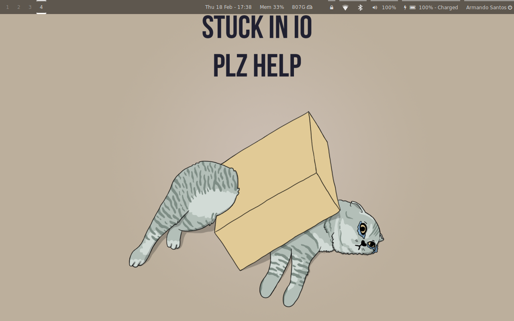
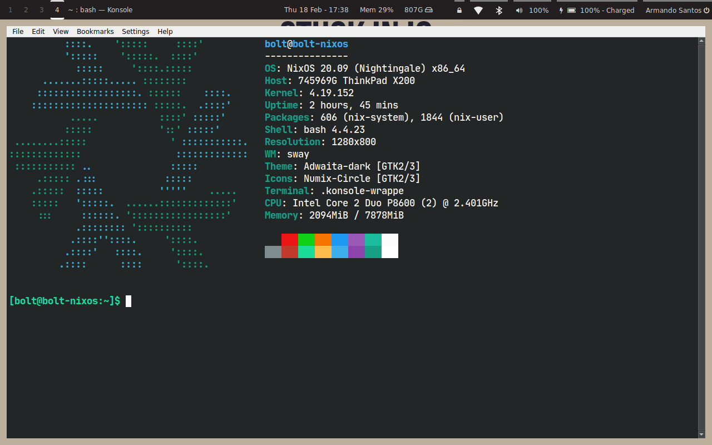

nix-config
==========

My current - and always evolving - NixOS configuration files, home-manager, neovim, etc.





## Programs

The `home.nix` file contains details about all the software I use but here's a shout-out to the ones I use the most and that are customized to my needs.

| Type           | Program      |
| :------------- | :----------: |
| Editor         | [NeoVim](https://github.com/neovim/neovim) |
| Launcher       | [Wofi](https://github.com/mikn/wofi) |
| Shell          | [Bash](https://www.gnu.org/software/bash/) |
| Status Bar     | [Waybar](https://github.com/Alexays/Waybar) |
| Terminal       | [Konsole](https://konsole.kde.org/) |
| Window Manager | [Sway](https://github.com/swaywm/sway) |

## Structure

Here is an overview of the folders' structure:

```
├── home
│   ├── display
│   ├── home.nix
│   ├── programs
│   └── services
│   └── xdg
├── imgs
├── install.sh
├── nix
├── notes
└── system
    ├── configuration.nix
    └── machine
    └── wm
```

- `home`: all the user programs, services and dotfiles.
- `imgs`: screenshots and other images.
- `install.sh`: the install script.
- `nix`: the pinned packages.
- `notes`: cheat-sheets, docs, etc.
- `system`: the NixOS configuration, settings for different laptops and window managers.

## Install

On a fresh NixOS installation, run the following commands:

```shell
mkdir DELETE_ME && cd DELETE_ME
nix-shell --run \
  "wget -c https://github.com/bolt12/nixos/archive/master.tar.gz && tar --strip-components=1 -xvf master.tar.gz" \
  -p wget s-tar
chmod +x install.sh && ./install.sh
```
