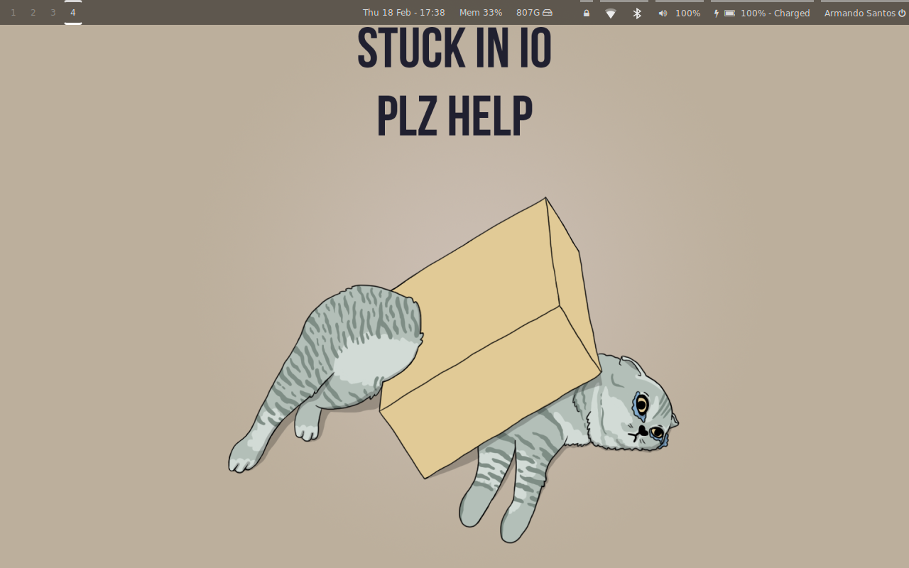
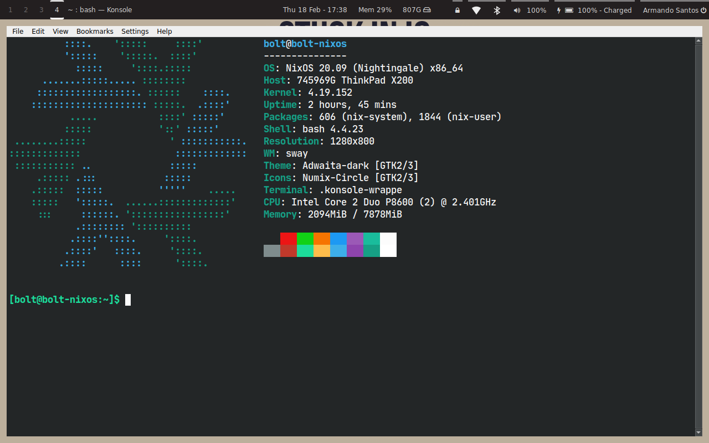

nix-config
==========

My NixOS and home-manager configuration: five machines and four home-manager
users built from one flake. Always evolving.





## Layout

```
flake.nix                    # Entry point: NixOS + HM configs, colmena, checks, apps
home-manager/
  common/                    # Shared base + the userConfig option system
    base.nix                 # Settings every user gets (nix, gpg, atuin, identity bridge)
    user-options.nix         # Typed userConfig.* options (git, monitors, agda, aliases)
  profiles/                  # Package collections mixed per user (desktop, development, ...)
  programs/                  # Per-program config (neovim, niri, git, waybar, ...)
  modules/ services/ xdg/    # Wayland env, user services, xdg wiring
  users/                     # Per-user configs (home.nix + user-data.nix)
    bolt/  bolt-with-de/  pollard/  steam-deck/
system/
  common/                    # constants.nix (ports/IPs/paths), overlays, shared services
  machine/                   # One directory per host
    ninho/  hetzner/  rpi/  x1-g8/  thinkpadx200/
install.sh                   # Interactive rebuild menu with pre-flight safety checks
```

The home-manager side layers three ways: `common/base.nix` for everything shared,
`profiles/` for reusable package sets, and `users/<name>/` for per-user choices.
`bolt-with-de` imports `bolt` and adds the desktop on top, so the headless and
desktop configs never duplicate.

## Machines

| Config | Arch | Host | Notes |
|--------|------|------|-------|
| `bolt-nixos` | x86_64 | ThinkPad X1 Carbon Gen 8 | Laptop, niri desktop (sway fallback), user `bolt` |
| `ninho-nixos` | x86_64 | Home server | Ryzen 9 9950X3D, RTX 5090, 128GB, ZFS; ~25 services; users `bolt` + `pollard` |
| `hetzner` | x86_64 | Hetzner Cloud VM | Public WireGuard hub + tunnel-only DNS resolver; deployed with colmena |
| `bolt-rpi5-sd-image` | aarch64 | Raspberry Pi 5 | Tang (LUKS auto-unlock), LAN DNS, Wake-on-LAN; SD image + colmena `rpi-5` node |
| `bolt-x200` | x86_64 | ThinkPad X200 | Incomplete stub (no `hardware-configuration.nix` yet), does not build |

## Home-manager users

| User | Target | Desktop | Notes |
|------|--------|---------|-------|
| `bolt` | ninho | No | Headless, full development toolchain |
| `bolt-with-de` | bolt-nixos | niri | Desktop; imports `bolt` and adds the compositor, bar, theming |
| `pollard` | ninho | No | Headless |
| `steam-deck` | Steam Deck | Gaming | Standalone on SteamOS (non-NixOS) via home-manager |

## Usage

### System rebuilds

```shell
sudo nixos-rebuild switch --flake .#bolt-nixos
sudo nixos-rebuild switch --flake .#ninho-nixos
sudo nixos-rebuild test   --flake .#ninho-nixos   # apply without touching the bootloader
```

The `rpi` and `hetzner` hosts deploy from colmena (they have no local checkout):

```shell
eval $(ssh-agent) && ssh-add ~/.ssh/id_ed25519
colmena apply --on rpi-5 --impure
colmena apply --on hetzner
```

### Standalone home-manager

```shell
home-manager switch --flake .#bolt
home-manager switch --flake .#pollard
home-manager switch --flake .#steam-deck
home-manager switch --flake .#bolt-with-de   # bolt-nixos also applies this via nixos-rebuild
```

### Interactive menu

`./install.sh` runs pre-flight checks (in a git repo, in sync with `origin/main`)
and offers apply/test/dry per host plus the per-user activations above.

### nix run shortcuts

```shell
nix run .#dry-ninho      # nixos-rebuild dry-build --flake .#ninho-nixos
nix run .#deploy-ninho   # sudo nixos-rebuild switch --flake .#ninho-nixos
nix run .#fmt            # format every Nix file with nixfmt-rfc-style
nix run .#update         # nix flake update
```

## Programs

The home-manager config carries the details for everything I use. The ones I
touch the most:

| Type | Program |
|------|---------|
| Editor | [Neovim](https://github.com/neovim/neovim) |
| Compositor | [niri](https://github.com/YaLTeR/niri) (Sway as fallback) |
| Bar | [DankMaterialShell](https://github.com/AvengeMedia/DankMaterialShell) (Waybar as fallback) |
| Launcher | [fuzzel](https://codeberg.org/dnkl/fuzzel) |
| Terminal | [Konsole](https://konsole.kde.org/) |
| Shell | [Bash](https://www.gnu.org/software/bash/) |

## Adding a new user

1. Create `home-manager/users/newuser/` (copy an existing user as a template):
   ```shell
   cp -r home-manager/users/pollard/* home-manager/users/newuser/
   ```
2. Edit `home.nix`: set `userConfig.username` / `homeDirectory` and choose which
   profiles and programs to import.
3. Edit `user-data.nix`: git name/email and personal aliases.
4. Register it in `flake.nix` under `homeConfigurations` via the `mkHome` helper:
   ```nix
   newuser = mkHome { module = ./home-manager/users/newuser/home.nix; };
   ```
5. For a NixOS-integrated user, wire it under `home-manager.users.<name>` in the
   host's config instead (see `system/machine/ninho/configuration.nix`).

## Forking Guide, adapting this config for your machines

Nothing here is a Nix-style "framework": services are plain NixOS modules and
home-manager modules, so picking a piece and copy-pasting it into your own flake
is the intended workflow. The list below is what you must change to make a fork
actually run.

### Per-machine values you must change

| Where | What |
| --- | --- |
| `system/common/constants.nix` | Everything in the **INFRASTRUCTURE-SPECIFIC** block at the top: LAN subnet/gateway, ninho/rpi VPN IPs and hostnames, WireGuard pubkey, storage paths. The **CONVENTIONAL** block (port grid, Wyoming voice ports) is usually fine to keep. |
| `home-manager/users/<user>/user-data.nix` | `userConfig.username`, `homeDirectory`, `git.{userName,userEmail}`, `sway.{primaryMonitor,externalMonitor,wallpaperPath}`, `agda.libraryRoot`. Personal aliases and Syncthing device IDs also live here. |
| `system/machine/ninho/boot.nix` | Initrd SSH keys for the LUKS unlock fallback (~line 118) and the LUKS partition UUIDs (~line 80-103). Run `blkid` on each LUKS partition and replace the UUIDs. |
| `system/machine/ninho/users.nix` | The bolt/pollard account SSH keys (~line 26, 50) and `initialPassword = "ninho"` (~line 25, 47). The password is a placeholder: change it before first boot, then `passwd` after login. |
| `system/machine/ninho/boot.nix` kernel/GPU | `boot.kernelPackages = pkgs.linuxPackages_6_18`, `kernelModules = [ ... "nvidia" ... ]`, and `nixpkgs.config.cudaSupport` are RTX 5090-specific. Drop or swap if you're on AMD/Intel. |
| `system/machine/ninho/hardware-configuration.nix` | Regenerate via `nixos-generate-config --root /mnt`. |
| `/etc/wireguard/private` on each WG host | One-time: `sudo install -m600 -o root -g root /path/to/your/wg-private /etc/wireguard/private`. The constant lives at `system/common/constants.nix`, `paths.wireguardPrivateKey`. |

### Embedded credentials inventory (rotate after forking)

These currently ship in plaintext in the tree and land world-readable in the Nix
store. Rotate them after you fork, and treat the forked tree as private until you
do, or move them to a secrets backend (sops-nix / agenix) before publishing:

- `system/machine/ninho/services/llama-cpp.nix`, `peers.z-ai.apiKey`: a live paid
  cloud LLM key. Rotate this at the provider, since it is already in git history.
- `system/machine/ninho/services/homepage.nix`: service API keys for the homepage
  dashboard widgets (deluge/miniflux/kavita/grafana auth).
- `system/machine/ninho/services/anki-sync-server.nix`: bolt's anki account password.
- `system/machine/ninho/services/nextcloud.nix`: admin password bootstrapped via tmpfiles.
- `system/machine/ninho/services/monitoring/exporters.nix`: exportarr API key files
  seeded via tmpfiles (`/var/lib/secrets/*-api-key`).

### Quick start

1. Fork the repo and clone it to `~/nixos`.
2. Edit the values above.
3. `nix develop` to enter the dev shell (nixfmt, statix, deadnix, nil, colmena).
4. `nix run .#dry-ninho` (or `.#dry-bolt`) to confirm the config evaluates.
5. `nix run .#deploy-ninho` (or `.#deploy-bolt`) to switch the system.
6. `home-manager switch --flake .#<user>` for per-user activation.

## Install on a fresh machine

```shell
mkdir DELETE_ME && cd DELETE_ME
nix-shell --run \
  "wget -c https://github.com/bolt12/nixos/archive/main.tar.gz && tar --strip-components=1 -xvf main.tar.gz" \
  -p wget s-tar
chmod +x install.sh && ./install.sh
```
